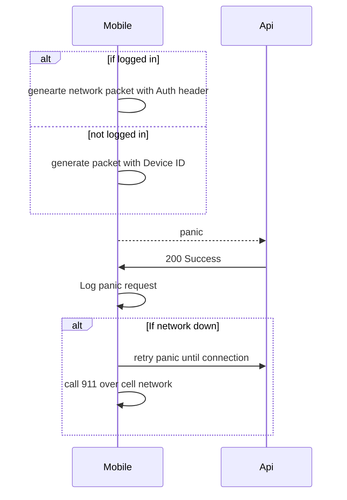

```mermaid
sequenceDiagram
    alt if logged in
    Mobile->Mobile: genearte network packet with Auth header
    else not logged in
    Mobile->Mobile: generate packet with Device ID
    end
    Mobile-->>Api: panic
    Api->>Mobile: 200 Success
    Mobile->>Mobile: Log panic request
    alt If network down
    Mobile->>Api: retry panic until connection
    Mobile->>Mobile: call 911 over cell network
    end
```

